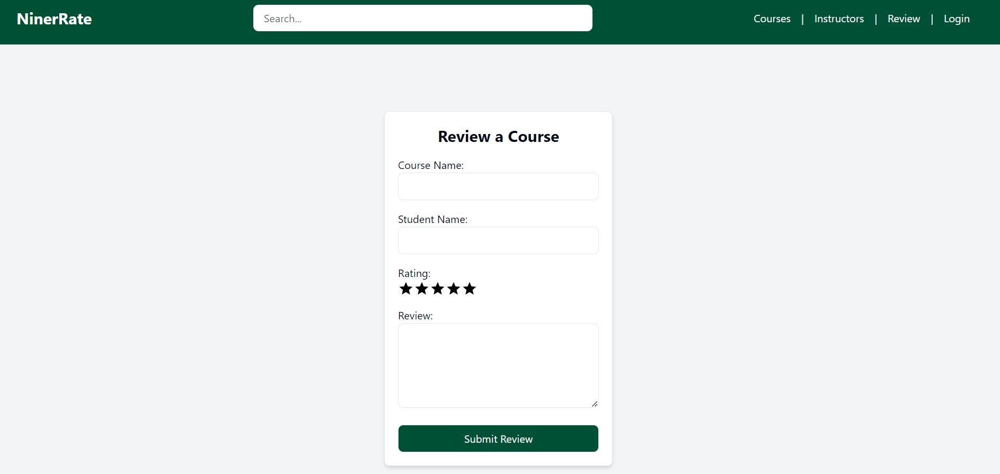

# Niner Rate

## Table of Contents:

1. [Niner Rate](#niner-rate)
2. [Screenshots Overview](#screenshots-overview)
3. [Project Overview](#project-overview)
4. [Key Features](#key-features)
5. [Project Proposal Presentation](#project-proposal-presentation)
6. [Sprints](#sprints)
   - [Sprint 1: Low Fidelity Prototype Video](#sprint-1-low-fidelity-prototype-video)
   - [Sprint 2: Working Prototype Video](#sprint-2-working-prototype-video)
   - [Sprint 3: Working Web Application Video](#sprint-2-working-prototype-video)
7. [Project Pitch](#project-pitch)
8. [Project Management with Trello](#project-management-with-trello)
9. [Version Control with GitHub](#version-control-with-github)
10. [UML Behavioral Diagrams](#uml-behavioral-diagrams)
    - [Behavioral Diagram](#behavioral-diagram)
    - [Use Case Diagram](#use-case-diagram)
11. [Design Documentation](#design-documentation)
    - [Architectural Overview](#architectural-overview)
    - [Subsystem Architecture](#subsystem-architecture)
    - [Deployment Architecture](#deployment-architecture)
    - [Persistent Data Storage](#persistent-data-storage)
    - [Global Control Flow](#global-control-flow)
    - [Time Dependency](#time-dependency)
    - [Concurrency](#concurrency)
    - [Detailed System Design Static View](#detailed-system-design-static-view)
    - [Detailed System Design Dynamic View](#detailed-system-design-dynamic-view)
12. [Developed Using](#developed-using)
13. [Deployment](#deployment)
14. [Contributors](#contributors)

## Screenshots Overview:

| Home Page                                                                                                      |
| -------------------------------------------------------------------------------------------------------------- |
|  |

| Home Page Search                                                                                                                    |
| ----------------------------------------------------------------------------------------------------------------------------------- |
|  |

| Nav Bar Search                                                                                                                |
| ----------------------------------------------------------------------------------------------------------------------------- |
|  |

| Courses                                                                                                  |
| -------------------------------------------------------------------------------------------------------- |
|  |

| Course Datail                                                                                                              |
| -------------------------------------------------------------------------------------------------------------------------- |
|  |

| Login                                                                                              |
| -------------------------------------------------------------------------------------------------- |
|  |

| Profile                                                                                                  |
| -------------------------------------------------------------------------------------------------------- |
|  |

| Instructors                                                                                                     |
| --------------------------------------------------------------------------------------------------------------- |
|  |

| Review                                                                                                |
| ----------------------------------------------------------------------------------------------------- |
|  |

## Project Overview:

Niner Rate is a fullstack web application designed as a sophisticated course rating system specifically for UNC Charlotte students. The platform's primary goal is to empower students with insightful information by allowing them to rate and review courses based on various criteria. Students can provide detailed feedback on course materials, teaching methodologies, and class structures. By promoting transparency in teaching styles, the application equips students with essential knowledge to navigate their academic journey effectively and prepare for their professional careers. It addresses the common issue of students enrolling in courses without a clear understanding of what to expect, thereby helping them avoid potential regrets.

Through Niner Rate, students can create, modify, and delete their reviews as needed, ensuring that feedback remains relevant and up-to-date. Additionally, the platform offers a comprehensive overview of ratings for courses offered by the College of Computing and Informatics (CCI), providing valuable insights into the educational landscape within the CCI domain. Ultimately, Niner Rate serves as a valuable resource for students seeking to make informed decisions and optimize their learning experiences.

This application stands as the capstone project for the ITSC 4155 Software Development Projects course at UNC Charlotte.

## Key Features:

`Course Rating System`: Users can rate courses based on various criteria such as course materials, teaching methodologies, and class structures. This feature provides valuable insights into the quality of courses offered at UNC Charlotte.

`Instructor Rating System`: Students can rate instructors based on their teaching effectiveness, communication skills, and overall engagement. This feature helps students make informed decisions when selecting courses.

`User Reviews`: Users can write detailed reviews sharing their experiences with specific courses and instructors. These reviews contribute to a transparent and informative platform for students.

`Dynamic Content`: The app provides real-time updates on course and instructor ratings, ensuring that users have access to the latest information.

`User Authentication`: Integration with Google Auth API allows only UNC Charlotte students to sign in and use the app, ensuring the authenticity of user-generated content.

`Customizable Profiles`: Users can customize their profiles, editing their first and last name.

`Search and Filter`: Users can search for courses by course code and name. Advanced filtering options help users find relevant information quickly.

`Modular Architecture`: The app is built using Component-Based Architecture (CBA), ensuring modularity, scalability, and maintainability for future development and enhancements.

`Continuous Deployment`: Deployment on AWS Amplify enables continuous integration and deployment, allowing for quick and seamless updates to the app without downtime.

## Project Proposal Presentation:

Our team presented our project proposal to the professor, outlining our ambitious plans for the application. This crucial video captures the moment when our team members shared their vision and objectives with the instructor. Following a thorough evaluation, the proposal received the green light, laying the foundation for our project's journey. Watch the video to witness the inception of our project and the approval of our proposal, setting the stage for the development ahead.

## Sprints:

For this project, the team employed an agile development approach, working on the application in sprints. During each sprint, various team members implemented different features and functionalities in the app. Explore the progress made during each sprint below to see how this app evolved from a low-level prototype to a fully functional web application.

#### Sprint 1: Low Fidelity Prototype Video:

In this video, we discuss and demonstrate how our app might look and function in its early stages during a walkthrough of the low fidelity prototype. It provides a comprehensive overview of the key features, user interface design, and user interactions envisioned for the application. Feel free to watch the video below to get a glimpse of our app's potential and the direction we're heading towards!

#### Sprint 2: Working Prototype Video:

In Sprint 2, our team proudly presents a functioning prototype of our application. This video demonstration showcases the progress we've made since the initial stages, highlighting key features and functionalities implemented during this sprint. Watch the video to see how our app is shaping up and get a glimpse of what's to come in future iterations.

#### Sprint 3: Working Web Application Deployed on AWS Amplify Video:

With the complete, fully functional Niner Rate web application deployed on AWS Amplify, we've achieved a significant milestone in our development journey. This deployment represents the culmination of our efforts, integrating all the refined features and functionalities developed throughout the sprint cycle. Now accessible to users, Niner Rate offers intuitive search capabilities, comprehensive instructor profiles, interactive course reviews, streamlined user authentication, and continuous database updates. The live platform on AWS Amplify provides UNCC students with a seamless and informative tool to navigate their academic journey confidently. As we celebrate this achievement, our commitment to enhancing Niner Rate and delivering an unparalleled user experience remains steadfast. Check out the video below for a demonstration of our app in action.

Discover the enhanced features of Niner Rate, designed to empower UNCC students in their academic journey. Our intuitive search bar enables effortless course exploration tailored to individual interests, while comprehensive instructor profiles provide valuable insights into educators. Seamlessly integrated with RateMyProfessor, users can access reviews to inform their decisions and contribute feedback. The ability to save courses, view ratings, and access detailed descriptions ensures a personalized and informed experience. With continuous updates to both the professors and course lists, Niner Rate maintains accuracy and relevance. Features such as UNCC Credentials login, anonymous browsing, and a personalized profile page further enhance usability and security. From browsing courses to creating and interacting with reviews, Niner Rate offers a comprehensive platform to streamline the academic journey for UNCC students.

## Project Pitch

Our pitch introduces an exciting project that encapsulates innovation and creativity through a video presentation, showcasing its unique value proposition and distinguishing features in the market. At its core, our pitch provides a clear explanation of our project's purpose, addressing specific needs and emphasizing the benefits of our solution. Additionally, we aim to make our pitch memorable by conveying our team's passion and dedication, sharing insights into our collaborative process and commitment to delivering excellence. Ultimately, our pitch tells a story of innovation, teamwork, and the potential impact of our project on the world, aiming to leave a lasting impression that resonates with our audience beyond the elevator ride. Watch the video below to see our project pitch.

## Project Management with Trello:

We utilize Trello for project management to keep our tasks organized and track progress visually.

`Task Organization`: Trello's boards, lists, and cards provide a visual representation of our project's workflow. We create boards for each project and populate them with lists representing different stages of our development process (e.g., Back Log, To Do, In Progress, Code Review, Documentation, Complete). Each card represents a task or user story, allowing us to break down work into manageable chunks.

`Assigning and Prioritizing Tasks`: Team members can assign themselves to cards and prioritize tasks based on their importance and urgency. We use labels, due dates, and checklists to provide additional context and ensure that everyone knows what needs to be done and when.

`Tracking Progress`: Trello's kanban-style boards make it easy to visualize the status of each task and track progress as work moves through the workflow. We regularly review our boards during standup meetings to identify bottlenecks, reassign tasks, and ensure that we're on track to meet our goals.

## Version Control with GitHub:

Our team leverages GitHub extensively for version control, enabling us to manage code changes efficiently across our projects. Through GitHub repositories, we maintain a centralized repository for the project, allowing team members to collaborate seamlessly. Here's how we use GitHub:

`Branching Strategy`: We follow a branching strategy such as GitFlow, where we have a main branch representing production-ready code and feature branches for development work. When starting work on a new feature or bug fix, team members create a new branch (`git checkout -b "new-branch-name"`) from main and work on their changes locally.

`Adding and Committing Changes`: As team members work on their branches, they make frequent adds and commits (`git add .` & `git commit -m "commit-message"`) to document their progress. We encourage descriptive commit messages that provide context about the changes being made. This helps in understanding the purpose of each change and facilitates easier code reviews.

`Pushing Changes`: Once the changes are ready for review, team members push their branches (`git push`) to the remote repository on GitHub. This makes their changes accessible to other team members for review and collaboration. By pushing changes regularly, we ensure that everyone has access to the latest codebase and can stay up-to-date with the project's progress.

`Code Review Process`: Pull requests (PRs) are created when a feature or bug fix is ready for review. Team members can review the code, leave comments, and suggest improvements directly within the PR interface on GitHub. We strive for a collaborative and constructive code review process, where feedback is provided respectfully and improvements are made iteratively.

`Merge and Deployment`: Once a pull request has been reviewed and approved by team members, it is merged into the main codebase. Depending on our deployment strategy, the changes are then deployed to staging or production environments automatically or manually.

`Fetching Updates`: Finally, in our IDE terminal, we execute `git pull` to retrieve the latest updates from GitHub. This ensures that our local repository is synchronized with the remote one and th codebase remain clean, stable, and well-documented. With this step completed, the process begins anew.

## UML Behavioral Diagrams:

#### Behavioral Diagram:

    

#### Use Case Diagram:

    

## Design Documentation:

#### Architectural Overview:

Niner Rate, being a Next.js application, was purposefully designed using Component-Based Architecture (CBA). This architectural approach offers several advantages, including heightened modularity, scalability, flexibility, maintainability, and developer productivity, all of which are crucial for building a robust and adaptable Next.js application like Niner Rate. By leveraging CBA, we aimed to ensure that our application architecture aligns with Next.js best practices while also facilitating seamless development and maintenance workflows. Additionally, our decision to adopt CBA reflects our commitment to exploring and mastering modern development methodologies within the context of Next.js applications. Thus, as a team, we unanimously selected CBA as the architectural foundation for Niner Rate to optimize its performance, extensibility, and long-term viability.

#### Subsystem Architecture:

#### Deployment Architecture:

- Frontend Hosting on AWS Amplify:

  - AWS Amplify hosts the frontend of your Next.js app, serving static src/assets such as CSS (including Tailwind CSS), JavaScript (including TypeScript), and media files to users.
  - Continuous Deployment: Amplify automatically builds and deploys changes to the frontend triggered by commits to your repository, ensuring seamless updates.

- Backend Functions (Serverless) on AWS Amplify:

  - Amplify provides serverless backend functions for handling dynamic logic and interacting with MongoDB Atlas.
  - Backend functions are written in TypeScript and executed on-demand in response to API requests from the frontend.

- API Gateway Integration:

  - AWS Amplify integrates with Amazon API Gateway to manage RESTful APIs and expose backend functions securely to the frontend.
  - API Gateway routes incoming requests to the corresponding backend functions, enabling CRUD operations on class courses, professors, and course reviews.

- Database Integration with MongoDB Atlas:

  - MongoDB Atlas serves as the cloud-based database for storing class courses, professor details, and course reviews.
  - Amplify backend functions connect securely to MongoDB Atlas using credentials and interact with the database using the MongoDB Node.js driver.

- Authentication with Google Auth API:

  - Google Auth API is used for authentication and authorization.
  - UNCC students authenticate using their Google accounts, ensuring only authorized users can access the app.
  - Upon successful authentication, users receive a token allowing access to protected routes and resources.

- Authorization and User Management:

  - Amplify functions verify tokens issued by Google Auth API to authorize access to protected routes and resources.
  - User management, including role-based access control (if needed), can be handled within the application logic.

#### Persistent Data Storage:

For persistent data storage in our project, we utilize MongoDB Atlas, a fully managed cloud database service. MongoDB Atlas offers a flexible and scalable solution for storing and querying data in a NoSQL document format.

###### Courses Collection/Table:

- \_id: Unique identifier assigned to the course record in the database.
- code: Course code representing the course, in this case, "ITSC 1212".
- title: Title of the course, which is "Introduction to Computer Science I".
- courseDescription: A brief description of the course content and objectives. In this case, it introduces basic computer literacy, computational thinking, and problem-solving skills.
- unccCatalogID: Catalog ID assigned by UNC Charlotte, which may be used for administrative purposes.
- unccCourseID: Course ID assigned by UNC Charlotte, serving as a unique identifier for the course within the university's system.

###### Instructors Collection/Table:

- \_id: Unique identifier for each instructor
- name: Name of the instructor
- title: Title of the instructor
- department: Department of the instructor
- phone: Phone number of the instructor
- email: Email address of the instructor
- office: Office location of the instructor
- rateMyProfessorsId: RateMyProfessors ID for the instructor

###### Reviews Collection/Table:

- \_id: Unique identifier assigned to the review record in the database.
- courseName: Name and code of the course being reviewed, in this case, "ITCS 3112 Design & Implementation of Object-Oriented System".
- rating: Numeric rating given by the student for the course, where 5 indicates the highest rating.
- studentName: Name of the student who provided the review.
- review: Feedback or comments provided by the student about the course, in this case, "Fun class!".
- createdAt: Timestamp indicating the date and time when the review was created, which is "2024-04-10T11:12:54.888+00:00".

###### Users Collection/Table:

- \_id: Unique identifier assigned to the user record in the database.
- email: Email address associated with the user's account, which is "_____@uncc.edu".
- firstName: First name of the user, in this case, "Bob".
- lastName: Last name of the user, in this case, "Doe".
- image: URL pointing to the user's profile image, which is "https://lh3.googleusercontent.com/a/______________".
- userId: Unique identifier associated with the user's account, which is "**\*\***\_\_**\*\***".
- savedCourses: An array containing the courses saved by the user. In this case, it contains one course: "ITSC 3155".

#### Global Control Flow:

NinerRate operates as an event-driven system, specifically tailored for the unique context of a university course review platform intended for UNC Charlotte students. While it offers a structured navigation path (home page, search, browse, login, review submission), the system does not enforce a linear, procedural workflow on its users. Instead, actions within NinerRate are triggered by user events such as logging in, searching for courses or instructors, and submitting reviews. This event-driven approach ensures a flexible and user-centric experience, accommodating the varied needs and preferences of UNCC students.

#### Time Dependency:

Our system incorporates time-dependent features, albeit not in the strict sense of a real-time system. Time-sensitive operations, such as session timeouts for logged-in users and periodic updates to course ratings based on new reviews, are implemented to enhance usability and data integrity. These operations are not real-time but are designed to execute within acceptable time frames that ensure a seamless user experience and up-to-date information display.

#### Concurrency:

Given the single-processor deployment architecture of NinerRate, our approach to concurrency is managed at the application level rather than through multi-threading at the system level. The Next.js framework, complemented by the MongoDB Atlas database, handles concurrent user actions (e.g., multiple users accessing course reviews, submitting reviews, or browsing instructor profiles simultaneously) efficiently. This is achieved through asynchronous I/O operations and event-loop management inherent in the Node.js environment, ensuring that the application remains responsive and scalable under varying loads.

Through the use of Component-Based Architecture, NinerRate ensures modularity and ease of component reuse, facilitating efficient handling of concurrent user interactions within the constraints of a single-processor system. Components such as user authentication (via NextAuth), course and instructor data retrieval, and review submission are designed to operate independently and seamlessly integrate, providing a robust and efficient user experience.

#### Detailed System Design Static View:

#### Detailed System Design Dynamic View:

## Developed Using:

![Next.js]
![NextAuth.js]
![React]
![React DOM]
![React Radix UI]
![react-icons]
![React OAuth Google]
![react-google-button]
![TypeScript]
![JavaScript]
![Node.js]
![Tailwind CSS]
![tailwind-merge]
![tailwindcss-animate]
![PostCSS]
![CSS]
![MongoDB]
![Mongoose]
![Autoprefixer]
![Github]
![Trello]

## Deployment:

The project has been deployed using [AWS Amplify](https://aws.amazon.com/amplify/) . You can access Niner Rate [here](https://main.d3f94s6am880j3.amplifyapp.com/).

## Contributors:

Oliver Briot, Kamaal Hassan, Willy Xiong, Txuj Yang, Jai Vang

<!-- MARKDOWN LINKS & IMAGES -->

[Next.js]: https://img.shields.io/badge/-Next.js-000000?style=for-the-badge&logo=next.js&logoColor=white
[NextAuth.js]: https://img.shields.io/badge/-NextAuth.js-000000?style=for-the-badge&logo=next.js&logoColor=white
[React]: https://img.shields.io/badge/-React-61DAFB?style=for-the-badge&logo=react&logoColor=white
[React DOM]: https://img.shields.io/badge/-React_DOM-61DAFB?style=for-the-badge&logo=react&logoColor=white
[React Radix UI]: https://img.shields.io/badge/-React_Radix_UI-61DAFB?style=for-the-badge&logo=react&logoColor=white
[React OAuth Google]: https://img.shields.io/badge/-React_OAuth_Google-61DAFB?style=for-the-badge&logo=google&logoColor=white
[react-google-button]: https://img.shields.io/badge/-react_google_button-61DAFB?style=for-the-badge&logo=google&logoColor=white
[react-icons]: https://img.shields.io/badge/-react_icons-61DAFB?style=for-the-badge&logo=react&logoColor=white
[TypeScript]: https://img.shields.io/badge/-TypeScript-3178C6?style=for-the-badge&logo=typescript&logoColor=white
[JavaScript]: https://img.shields.io/badge/-JavaScript-yellow?style=for-the-badge&logo=javascript
[Node.js]: https://img.shields.io/badge/node.js-339933?style=for-the-badge&logo=nodedotjs&logoColor=white
[Tailwind CSS]: https://img.shields.io/badge/-Tailwind_CSS-38B2AC?style=for-the-badge&logo=tailwind-css&logoColor=white
[tailwind-merge]: https://img.shields.io/badge/-tailwind_merge-38B2AC?style=for-the-badge&logo=tailwind-css&logoColor=white
[tailwindcss-animate]: https://img.shields.io/badge/-tailwindcss_animate-38B2AC?style=for-the-badge&logo=tailwind-css&logoColor=white
[PostCSS]: https://img.shields.io/badge/-PostCSS-DD3A0A?style=for-the-badge&logo=postcss&logoColor=white
[CSS]: https://img.shields.io/badge/-CSS-blue?style=for-the-badge&logo=css3
[MongoDB]: https://img.shields.io/badge/MongoDB-F5F7FA?style=for-the-badge&logo=mongodb&logoColor=6BA242
[Mongoose]: https://img.shields.io/badge/Mongoose-880000?style=for-the-badge&logo=mongoose&logoColor=FFFFFF
[Autoprefixer]: https://img.shields.io/badge/-Autoprefixer-DD3A0A?style=for-the-badge&logo=autoprefixer&logoColor=white
[GitHub]: https://img.shields.io/badge/-GitHub-181717?style=for-the-badge&logo=github&logoColor=white
[Trello]: https://img.shields.io/badge/-Trello-0079BF?style=for-the-badge&logo=trello&logoColor=white
